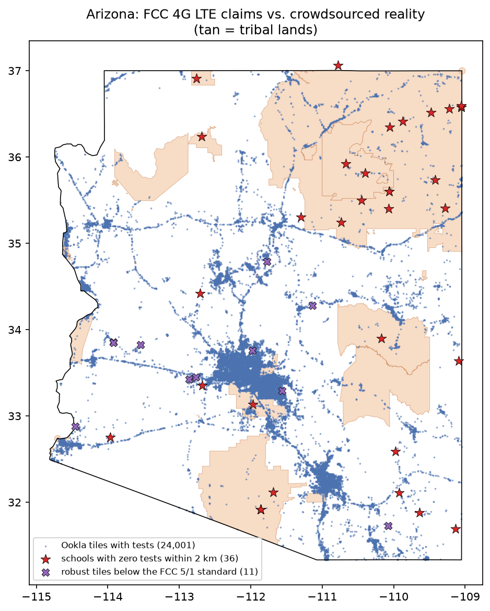
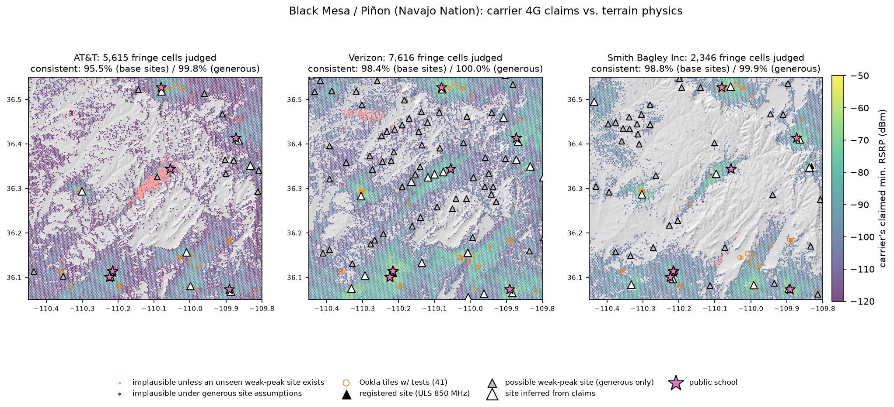
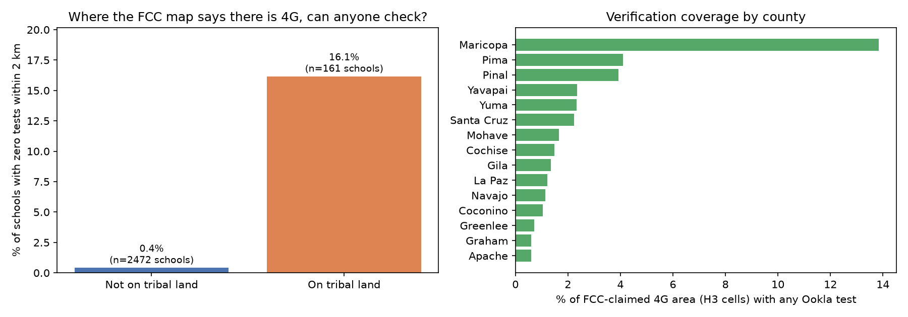

# Coverage Truth

**Can anyone check the FCC's cell-coverage map where it matters most? We compared carriers' 4G LTE claims
across Arizona with 184,512 real speed tests and with terrain physics, focusing on the areas around 2,633 public schools.**

Built by Sahi (NVIDIA 6G Developer Program member) with Claude as co-builder, September 2026.
Physics: NVIDIA Sionna RT plus an ITU-R P.526 terrain-diffraction model on Copernicus 30 m terrain.

**Live tool: [adhabnr-ux.github.io/coverage-truth](https://adhabnr-ux.github.io/coverage-truth/)**. Look up any Arizona
public school to see its FCC 4G claim, how many speed tests have checked it, and, around Black Mesa and Whiteriver,
what terrain physics says. Built by `python -m ct.site` into `docs/index.html`.



## Findings

1. **Where people run speed tests, the FCC map mostly holds.** Of 3,563 map tiles that the FCC
   shows as fully covered and that have enough tests to trust (≥10 tests, ≥3 devices, ≥2 quarters),
   only **11 (0.31%)** average below the FCC's 5/1 Mbps 4G standard. Only 1 misses on download speed; the
   other 10 miss only on upload.
2. **The real problem is a verification gap, and it falls on tribal lands.**
   - **16.1%** of schools on tribal land had **zero** speed tests within 2 km over the past year, vs.
     **0.4%** of other schools (about 40× more).
   - Only **0.6%** of FCC-claimed 4G area on tribal land has ever been tested, vs. 3.7% elsewhere
     (Hopi 0.12%, Tohono O'odham 0.19%, Navajo Nation 0.57%). Schools on tribal land sit in
     poorer neighborhoods: median income-to-poverty ratio 124 vs. 258.
   - Crowdsourcing can't audit these places; physics can.
3. **The carriers' own maps give away where their towers are.** Strong claimed-signal contours hug
   towers, so clustering them locates sites that appear in no public database (AWS/PCS/700 MHz sites
   are not registered in FCC ULS). Validation: every registered tower inside the study areas was
   recovered to within **0.26–0.86 km**, and one at the area's edge to within 2.1 km.
4. **Terrain physics check of the claims (Whiteriver, Fort Apache; Black Mesa / Piñon, Navajo Nation):**

   | Area | Carrier | Fringe cells judged | Implausible (base sites) | Implausible (generous sites) |
   | --- | --- | ---: | ---: | ---: |
   | Whiteriver | Smith Bagley | 829 | 1 (0.1%) | 0 |
   | Black Mesa | AT&T | 5,615 | 253 (4.5%) | 10 |
   | Black Mesa | Verizon | 7,616 | 123 (1.6%) | 0 |
   | Black Mesa | Smith Bagley | 2,346 | 28 (1.2%) | 2 |

   Claims are mostly physically possible. The main exception is AT&T's coverage around **Black Mesa
   Community School**, a school with **zero** speed tests within 2 km. For that claim to be true, AT&T
   needs a tower near the school whose strongest claimed signal is only −90 dBm, and none shows up
   in any public source. That is a specific, checkable prediction (look for the tower, or run a single drive
   test), which is exactly what this tool is for.

Full tables: [`results/physics_table.md`](results/physics_table.md), [`results/summary.json`](results/summary.json).




## How it works

```
FCC BDC 4G LTE claims (H3 res-9 hexagons, per carrier, with claimed min. RSRP)
        │
        ├── vs. Ookla open speed-test tiles (z16, 4 quarters) ── statewide claims-vs-reality, per school
        │
        └── physics check, per area and carrier
              1. sites = FCC ULS registered sites + sites inferred from the strongest claimed contours
              2. terrain path loss site → every hexagon (free space + Bullington knife-edge, 4/3 earth)
              3. predicted RSRP = 33 dBm EIRP per resource element − path loss (optimistic on purpose)
              4. a claim is "implausible" if even this optimistic prediction is > 6 dB short of it
```

Details, assumptions and limits: [`docs/METHODS.md`](docs/METHODS.md).

**Cross-check against NVIDIA Sionna RT** (same DEM, 60 receivers around a registered Whiteriver tower):
for line-of-sight links, Sionna and the terrain model agree to **0.01 dB in 24 of 30** cases (the other 6
are grazing links where the knife-edge model adds up to 5 dB of Fresnel-zone loss). For obstructed links,
Sionna RT's single-order diffraction finds **no path 60%** of the time, which is why the terrain-profile
method is used at scale. This limitation is itself the starting point for Project #2.

## Honest corrections (kept on purpose)

- An early version of the terrain loader read a DEM window that ran past a tile edge. rasterio silently clipped it,
  so the terrain was misregistered by about 9 km. That produced a false "31 implausible hexagons" at Whiteriver
  (really 1). Fixed by mosaicking tiles with explicit bounds, and guarded by `tests/test_core.py::test_dem_mosaic_is_registered_across_tile_edge`.
- Single-level tower inference missed towers whose strongest contour is weaker than the carrier's best.
  That inflated Verizon's implausible rate at Black Mesa to 15%. Multi-level peak finding fixed it (1.6%), and the "generous"
  scenario bounds the remaining uncertainty.

## Reproduce

```bash
python -m venv venv && . venv/bin/activate && pip install -r requirements.txt
python -m ct.build_inputs          # Ookla, NCES schools + poverty, ULS towers, Census boundaries
# FCC files: broadbandmap.fcc.gov blocks scripted downloads. Download "Arizona → Mobile → 4G LTE → ESRI
# Shapefile" by hand into data/, then (for per-carrier signal levels) run tools/fcc_inpage_extract.js
# in a broadbandmap.fcc.gov tab — see docs/METHODS.md.
python -c "from ct.fcc_dbf import read_dbf; read_dbf('data/bdc_04_4GLTE_mobile_broadband_h3_D25_15sep2026.dbf').to_parquet('work/fcc_az_4glte_any.parquet')"
python -m ct.statewide             # claims vs. Ookla vs. schools
python -m ct.run_physics           # physics check, all areas/carriers/scenarios (~25 min on 2 CPU cores)
python -m ct.crosscheck_sionna     # Sionna RT cross-check
python -m ct.figures && python -m ct.report
python -m pytest -q tests          # 10 tests
```

## Repository map

| Path | What |
| --- | --- |
| `ct/build_inputs.py` | downloads + builds Ookla/school/tower tables (verified to reproduce ours exactly) |
| `ct/fcc_dbf.py` | fast reader for the 1.8M-row FCC attribute table |
| `ct/statewide.py` | claims vs. Ookla tiles vs. schools, tribal-land join |
| `ct/physics_check.py` | site inference, terrain path loss, plausibility verdicts, sensitivity |
| `ct/terrain_model.py`, `ct/terrain_scene.py`, `ct/pathsim.py` | propagation model, DEM mosaic + Sionna scene, Sionna path solver |
| `tools/fcc_inpage_extract.js`, `ct/inpage.py` | browser-side FCC extractor + decoder |
| `ct/site.py`, `site/` | builds the public school lookup page (`docs/index.html`, GitHub Pages) |
| `results/` | every number quoted above |
| `figures/` | all figures |

## Data sources and licenses

FCC Broadband Data Collection (public domain) · Ookla Open Data (CC BY-NC-SA 4.0, attribution: "Speedtest®
by Ookla® Global Fixed and Mobile Network Performance Maps") · NCES EDGE school locations and School
Neighborhood Poverty estimates · FCC ULS via HIFLD Cellular Towers · US Census cartographic boundaries ·
Copernicus GLO-30 DEM (© DLR/Airbus, provided under COPERNICUS by the European Union and ESA).
Because of the Ookla license, derived results are for non-commercial research use.

Code: MIT License.
